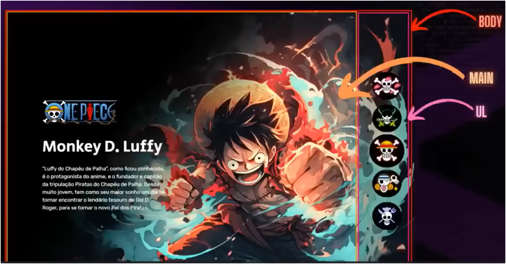

# One Piece Character Selector

Um projeto interativo e responsivo que permite ao usuário explorar personagens do anime One Piece com uma interface visual envolvente. Desenvolvido com HTML, CSS e JavaScript puro, o projeto simula uma galeria de personagens com transições suaves, botões interativos e uma experiência imersiva.

## 🚀 Funcionalidades

- ✅ Seleção de personagens com transição suave de imagem
- ✅ Destaque visual para o botão selecionado
- ✅ Layout responsivo para dispositivos móveis
- ✅ Botão central com estilo minimalista e efeito hover
- ✅ Alerta automático após 3 segundos convidando o usuário a clicar na logo
- ✅ Ação de clique na logo do One Piece que redireciona para assistir ao anime gratuitamente

## 🛠️ Tecnologias Utilizadas

- HTML5
- CSS3 (com transições e responsividade)
- JavaScript (DOM, eventos, manipulação dinâmica)

## 📸 Demonstração

 <!-- Substitua por uma imagem real se desejar -->

## 📂 Como usar

1. Clone o repositório:
   ```bash
   git clone https://github.com/seu-usuario/one-piece-selector.git

